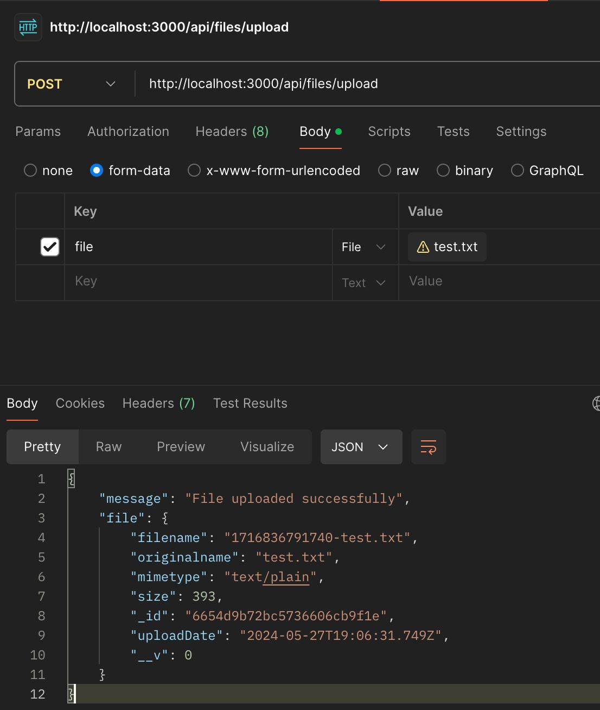

# File Download System

This project is a simple file upload and download system. It allows users to upload files to the server and download them later.

## Features

- **File Upload**
- **File Download**

## Getting Started

### Prerequisites

To run this project locally, you need to have the following installed:

- Node.js
- npm

### Installation

1. Clone the repository:

   ```bash
   git clone https://github.com/muhammedaliuyanik/file_download_system.git
   ```

2. Navigate to the project directory:

   ```bash
   cd file_download_system
   ```

3. Install the dependencies:

   ```bash
   npm install
   ```

### Running the Application

To start the application, run:

```bash
npm start
```

The application will be running on `http://localhost:3000`.

## Project Structure

- `server.js`: The main file that sets up the Express server.
- `routes/files.js`: Contains the routes for handling file uploads and downloads.
- `controllers/fileController.js`: Contains the logic for file upload and download operations.
- `middlewares/upload.js`: Middleware for handling file uploads using Multer.
- `models/file.js`: Mongoose schema for storing file metadata in the database.

## Modules Used

- **Express**: Web framework for Node.js used to build the API.
- **Multer**: Middleware for handling `multipart/form-data`, used for file uploads.
- **Mongoose**: ODM for MongoDB, used to define the schema for file metadata and interact with the database.
- **dotenv**: Module to load environment variables from a `.env` file.

### Environment Variables

Create a `.env` file in the root directory and add the following:

```
PORT=3000
MONGODB_URI=mongodb://localhost:27017/file_download_system
```

## API Endpoints

### Upload File



- **URL**: `http://localhost:3000/api/files/upload`
- **Method**: `POST`
- **Body**: `form-data`
  - Key: `file`, Type: `File`, Value: `<your-file>`

- **Response**:
  ```json
  {
    "message": "File uploaded successfully",
    "file": {
      "filename": "1716836791740-test.txt",
      "originalname": "test.txt",
      "mimetype": "text/plain",
      "size": 393,
      "_id": "6654d9b72bc5736606cb9f1e",
      "uploadDate": "2024-05-27T19:06:31.749Z",
      "__v": 0
    }
  }
  ```

### Download File

- **URL**: `http://localhost:3000/api/files/download/:filename`
- **Method**: `GET`
- **Params**: `:filename` - The name of the file to be downloaded.

## Postman Testing

### Upload File

1. Open Postman.
2. Create a new `POST` request.
3. Set the URL to `http://localhost:3000/api/files/upload`.
4. Go to the `Body` tab and select `form-data`.
5. Add a new key:
   - Key: `file`, Type: `File`, Value: `<your-file>`
6. Click `Send`.

You should receive a response indicating that the file has been uploaded successfully.

### Download File

1. Open Postman.
2. Create a new `GET` request.
3. Set the URL to `http://localhost:3000/api/files/download/:filename` (replace `:filename` with the actual filename).
4. Click `Send`.

The file should be downloaded to your local machine.
